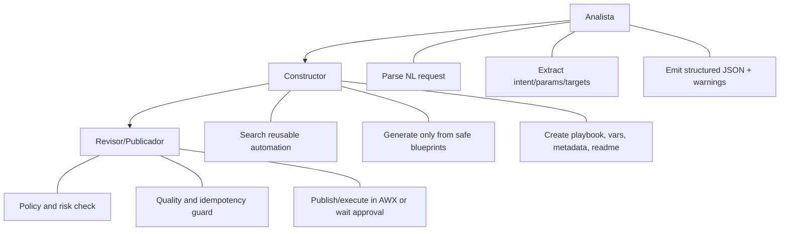

# Architecture

## Purpose
Automation Factory Lite is a low-risk automation factory, focused on creating reusable automation capital. It never executes out-of-catalog or forbidden actions.

## Modules
- `apps/backend`: API and persistence.
- `apps/frontend`: executive + technical UI (`/servicenow-connector` connector console, `/servicenow` technical operations).
- `services/orchestrator`: multi-agent workflow and transitions.
- `services/cmdb_sim`: host and action validation.
- `services/policy_engine`: risk classification and approvals.
- `services/playbook_factory`: secure blueprint-based generation.
- `services/automation_catalog`: reuse-first automation registry.
- `services/awx_client`: AWX publication/execution (`mock` + `real`).
- `services/itsm_notifier`: optional outbound ticket/webhook notifications.
- `services/servicenow_sim`: simulated ServiceNow cases + queue-processing agent + MCP exposure.
- `ansible`: inventories, templates, static and generated playbooks.

Primary ServiceNow-facing endpoints:
- `GET /api/servicenow/mcp/status`
- `GET /api/servicenow-mcp/cases`
- `GET /api/servicenow-mcp/cases/{number}`
- `POST /api/servicenow-mcp/cases`
- `POST /api/servicenow-mcp/cases/seed`
- `POST /api/servicenow-mcp/agent/run`

Service separation:
- ServiceNow-sim runs as dedicated API on port `18095` by default.
- ServiceNow-sim also exposes its own standalone portal at `http://<host>:18095/`.
- Automation Factory Lite backend (port `18010`) integrates through MCP bridge semantics and external client calls.
- Automation Factory Lite frontend (port `13000`) only talks to AFL backend; it never talks directly to ServiceNow-sim.

Default local runtime ports:
- `13000` -> Automation Factory Lite frontend
- `18010` -> Automation Factory Lite backend API
- `18095` -> ServiceNow-sim API (MCP bridge target)

## End-to-end Flow

```mermaid
flowchart LR
    SNOW[ServiceNow Sim Queue] --> AGENT[Queue Agent]
    AGENT --> API
    UI[UI Intake] --> API[FastAPI /api/requests]
    API --> ANALISTA[Analista]
    ANALISTA --> CMDB[CMDB Sim Validation]
    CMDB --> CONSTRUCTOR[Constructor]
    CONSTRUCTOR --> CATALOG[Catalog Reuse?]
    CATALOG -->|yes| REVIEW[Revisor/Publicador]
    CATALOG -->|no| FACTORY[Playbook Factory]
    FACTORY --> REVIEW
    REVIEW --> POLICY[Policy Engine]
    POLICY -->|low| AWX[AWX Publish + Execute]
    POLICY -->|medium| APPROVAL[UI Approval]
    APPROVAL --> AWX
    POLICY -->|high / out of scope| REJECT[Reject with explanation]
    AWX --> AUDIT[Audit + Timeline + History]
    AWX --> TICKET[Ticket Correlation/Webhook]
    REJECT --> AUDIT
    REJECT --> TICKET
    MCP[MCP Client] --> SNOW
```

## Agent Responsibilities

## Data Model Summary
- `automation_requests`
- `timeline_events`
- `approval_decisions`
- `execution_records`
- `automation_catalog`
- `cmdb_hosts`
- `audit_logs`

Ticket correlation fields:
- `automation_requests.ticket_id`
- `execution_records.ticket_id`
- `audit_logs.ticket_id`
- `servicenow_cases.number` (used as `ticket_id`)
- `servicenow_case_events` (event trail per case)

## Security Decisions
- Blocked domains: firewall, sudoers, kernel, network, secrets, databases, massive upgrades.
- Strict allowlist on request types and parameters.
- Safe defaulting for minor ambiguities with warning trail.
- No arbitrary playbook synthesis.
- Every execution injects `afl_ticket_id` and `afl_request_id` in AWX `extra_vars` for external correlation.
- ServiceNow queue agent never executes out-of-catalog requests; unsupported cases are escalated to manual attention.

## Real vs Mock
- `AWX_MODE=mock` by default.
- Real AWX path available when credentials and connectivity exist.
- If real fails, mock fallback keeps demo and testing functional.
