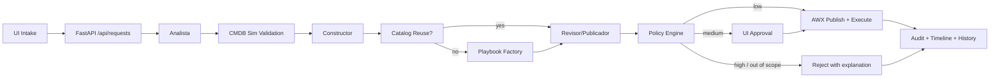
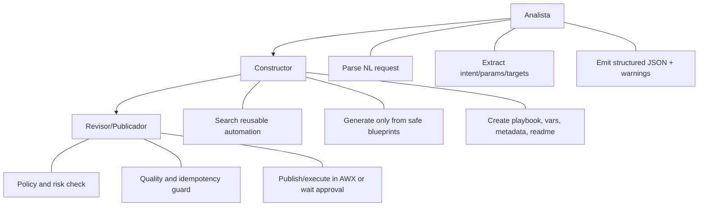

# Architecture

## Purpose
Automation Factory Lite is a low-risk automation factory, focused on creating reusable automation capital. It never executes out-of-catalog or forbidden actions.

## Modules
- `apps/backend`: API and persistence.
- `apps/frontend`: executive + technical UI.
- `services/orchestrator`: multi-agent workflow and transitions.
- `services/cmdb_sim`: host and action validation.
- `services/policy_engine`: risk classification and approvals.
- `services/playbook_factory`: secure blueprint-based generation.
- `services/automation_catalog`: reuse-first automation registry.
- `services/awx_client`: AWX publication/execution (`mock` + `real`).
- `ansible`: inventories, templates, static and generated playbooks.

## End-to-end Flow

## Agent Responsibilities

## Data Model Summary
- `automation_requests`
- `timeline_events`
- `approval_decisions`
- `execution_records`
- `automation_catalog`
- `cmdb_hosts`
- `audit_logs`

## Security Decisions
- Blocked domains: firewall, sudoers, kernel, network, secrets, databases, massive upgrades.
- Strict allowlist on request types and parameters.
- Safe defaulting for minor ambiguities with warning trail.
- No arbitrary playbook synthesis.

## Real vs Mock
- `AWX_MODE=mock` by default.
- Real AWX path available when credentials and connectivity exist.
- If real fails, mock fallback keeps demo and testing functional.
